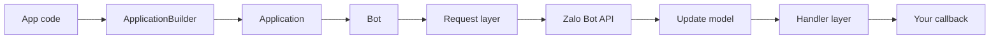

# Architecture

## Overview

The SDK is currently organized into clear layers:

- `src/request`: HTTP transport and API error mapping
- `src/models`: payload parsing for `User`, `Chat`, `Message`, `Update`, `WebhookInfo`
- `src/core`: `Bot`, `Application`, `ApplicationBuilder`, `CallbackContext`
- `src/handlers`: command and message handling
- `src/filters`: composable update filters
- `src/i18n`: runtime message dictionaries for `vi/en`

## Runtime flow

## Porting direction

This project is based on the `python_zalo_bot` reference package, but it is not a mechanical port. The TypeScript version intentionally simplifies Python-specific patterns:

- no `__slots__` or sentinel default wrappers
- explicit `initialize()` and `shutdown()` lifecycle
- lighter TypeScript-native models and parsers
- fallback parsing for thin API message responses

## What each layer is responsible for

### `src/request`

This is the transport layer. It handles:

- HTTP requests to the Zalo Bot API
- timeout handling
- mapping HTTP/API failures to SDK errors

### `src/models`

This layer parses raw payloads into objects that are easier to use in handlers and app code.

### `src/core`

This is the main orchestration layer:

- `Bot` sends requests and wraps API methods
- `Application` runs polling and dispatches updates
- `ApplicationBuilder` provides a cleaner setup flow

### `src/handlers` and `src/filters`

These power the event-driven developer experience:

- `CommandHandler` for commands like `/start`
- `MessageHandler` for text and other content
- `filters` for readable matching rules

### `src/i18n`

This layer reads `ZALO_BOT_LANG` and decides whether runtime messages should be emitted in Vietnamese or English.

## Current limitations

- no full multipart media abstraction yet
- no worker queue layer yet
- no framework-specific webhook adapters packaged separately

## Polling lifecycle

1. Build the app with `ApplicationBuilder`
2. `Application.runPolling()` calls `Bot.initialize()`
3. `Bot.initialize()` validates the token through `getMe()`
4. `Application` repeatedly calls `getUpdate()`
5. payloads are parsed into `Update` and `Message`
6. the first matching handler processes the update
7. your callback can reply through `replyText()` or other bot methods
