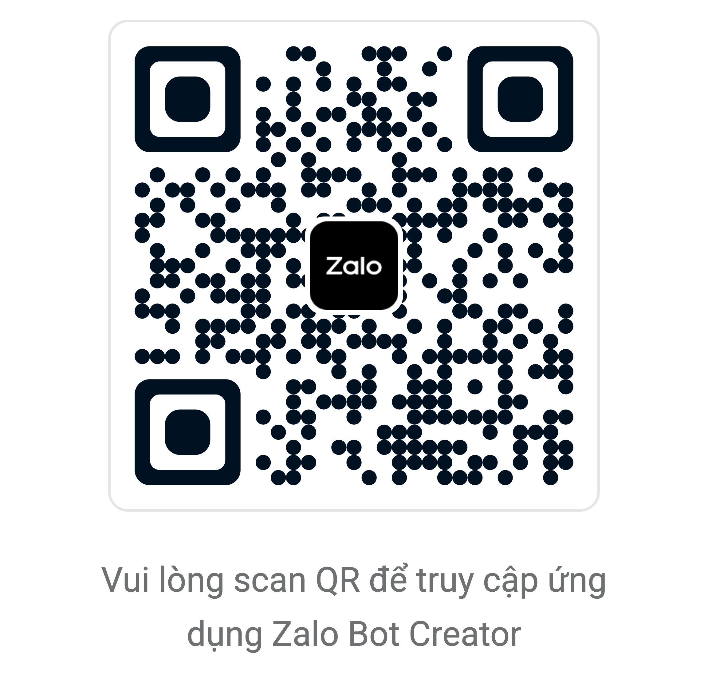

# Getting started

This page walks you through environment setup, bot token configuration, and the first basic flows with `zalo-bot-js`.

If you are new to the SDK, follow this order: create the bot, install dependencies, create `.env`, verify the token, and then run the polling bot.

## Requirements

- Node.js 18 or newer
- a valid Zalo Bot token

## Create the bot and get the token

Before running the examples in this documentation, create a bot in the bot management portal and copy the token for your environment.

Recommended flow:

1. Open the bot management page by scanning the QR code below.
2. Sign in and create a new bot for your use case.
3. Copy the bot token after the bot is created successfully.
4. Save the token into `.env` before running the local test scripts.



If you are reading the documentation on a different screen or device, scan the QR code to jump directly to the bot management page.

## Install dependencies

```bash
npm install
```

## Create `.env`

Create a `.env` file in the project root:

```dotenv
ZALO_BOT_TOKEN=your_zalo_bot_token_here
ZALO_BOT_LANG=vi
```

`ZALO_BOT_LANG` supports:

- `vi`: runtime logs and helper messages in Vietnamese
- `en`: runtime logs and helper messages in English

If unset, the current default is `vi`.

## Choose API style

`zalo-bot-js` supports two long-term styles and both share the same command parsing behavior:

- Event API (`bot.on(...)`, `bot.command(...)`) as the primary style for most bots.
- Handler API (`ApplicationBuilder`, `CommandHandler`, `MessageHandler`) for teams that prefer handler/filter routing.

Because command parsing is shared, `/Start  demo` and `/start demo` are matched the same way in both styles.

## Verify the token

```bash
npm run test:token
```

This script:

- loads `.env`
- reads `ZALO_BOT_TOKEN`
- creates `Bot`
- calls `getMe()`
- prints the bot profile in the selected runtime language

## Run the hello bot

```bash
npm run test:hello-bot
```

Then send:

- `/start`
- `hello`

to validate the basic message flow.

This test script uses:

- `ApplicationBuilder`
- `CommandHandler("start", ...)`
- `MessageHandler(...)`

It is the fastest way to confirm polling, update parsing, handler matching, and message replies.

## Minimal startup example

```ts
import { ApplicationBuilder, CommandHandler } from "zalo-bot-js";

const app = new ApplicationBuilder()
  .token(process.env.ZALO_BOT_TOKEN!)
  .build();

app.addHandler(new CommandHandler("start", async (update) => {
  await update.message?.replyText("Hello!");
}));

void app.runPolling();
```

## When to use each test script

- `test:token`: validate token and bot identity only
- `test:hello-bot`: validate token, polling, handlers, and reply flow together

## Practical notes

- long polling may wait for a while when there are no new updates
- if the API returns a thin response payload, the SDK already includes fallback parsing for sent messages
- webhook is a better fit once you have a stable public server and URL

## Next

- See [Examples and tests](./examples.md) if you want to choose between polling, webhook, and validation scripts.
- Read [Architecture](./architecture.md) if you want to understand how the SDK is organized before extending it.

Last updated: April 5, 2026
