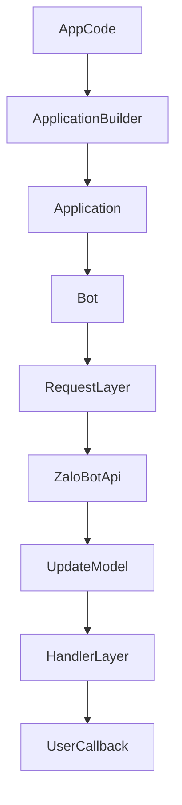

# Kiến trúc

## Tổng quan

SDK hiện tại được chia theo các lớp rõ ràng:

- `src/request`: xử lý HTTP transport và map lỗi API
- `src/models`: parse payload thành `User`, `Chat`, `Message`, `Update`, `WebhookInfo`
- `src/core`: `Bot`, `Application`, `ApplicationBuilder`, `CallbackContext`
- `src/handlers`: xử lý command và message
- `src/filters`: các bộ lọc có thể kết hợp
- `src/i18n`: hệ thông điệp runtime cho `vi/en`

## Luồng chạy cơ bản

## Mapping từ Python sang TypeScript

Project này được tham chiếu từ `python_zalo_bot`, nhưng không copy cơ học. Một số phần đã được đơn giản hóa:

- bỏ các pattern Python-only như `__slots__`, sentinel defaults, freeze object
- giữ lifecycle rõ ràng qua `initialize()` và `shutdown()`
- ưu tiên object và parser TypeScript gọn hơn
- fallback parse cho response gửi tin nhắn nếu API trả payload mỏng

## Vai trò của từng khối chính

### `src/request`

Đây là lớp đáy của SDK. Nó chịu trách nhiệm:

- gọi HTTP tới Zalo Bot API
- xử lý timeout
- map HTTP status sang custom error

### `src/models`

Các model nhận payload thô và chuyển thành object dễ dùng hơn trong code, ví dụ:

- `Update`
- `Message`
- `User`
- `Chat`

### `src/core`

Đây là phần điều phối chính:

- `Bot`: client gọi API
- `Application`: vòng polling và dispatch update
- `ApplicationBuilder`: cách khởi tạo app rõ ràng hơn

### `src/handlers` và `src/filters`

Hai phần này tạo ra kiểu lập trình event-driven:

- `CommandHandler` dùng cho command như `/start`
- `MessageHandler` dùng cho text, photo hoặc các filter khác
- `filters` cho phép kết hợp điều kiện theo kiểu dễ đọc

### `src/i18n`

Phần này đọc `ZALO_BOT_LANG` và quyết định log/runtime message nên hiển thị bằng tiếng Việt hay tiếng Anh.

## Giới hạn hiện tại

- chưa có media upload abstraction đầy đủ
- chưa có worker queue layer
- webhook framework adapters chưa tách thành package riêng

## Luồng chạy khi polling

1. App được tạo từ `ApplicationBuilder`
2. `Application.runPolling()` gọi `Bot.initialize()`
3. `Bot.initialize()` kiểm tra token qua `getMe()`
4. `Application` lặp `getUpdate()`
5. `Update` được parse thành model
6. Handler đầu tiên match sẽ xử lý update
7. Callback của bạn có thể gọi `replyText()` hoặc các method gửi message khác
